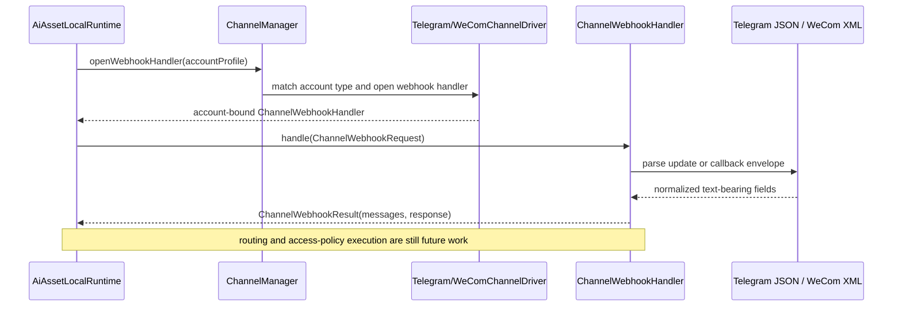
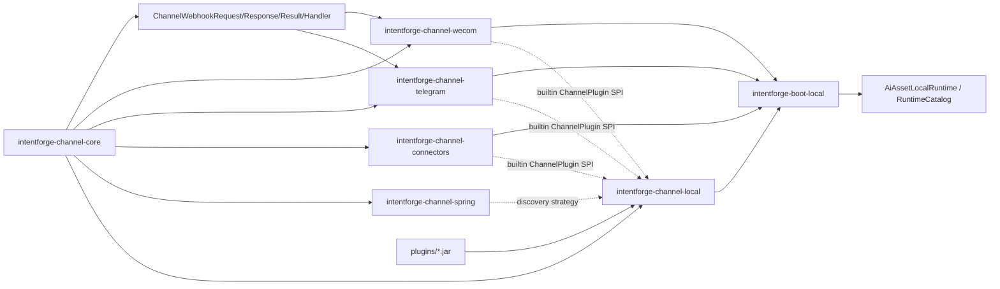

# Task: Channel Runtime Module

## Requirement
Create a new `intentforge-channel` aggregate module with four submodules under the current project.
The implementation should reference the OpenClaw channel design, support pluggable multi-channel integrations,
and provide Spring SPI friendly extension points. Code comments must use English.
After the runtime spine is complete, continue by adding concrete Telegram and WeCom connector implementations
inside dedicated `intentforge-channel-telegram` and `intentforge-channel-wecom` submodules instead of keeping them
inside `intentforge-channel-connectors`.
After the outbound delivery and module split work is complete, continue by adding inbound webhook adapters
that normalize Telegram and WeCom callback payloads into connector-local inbound models and shared
`ChannelInboundMessage` records.
After inbound normalization is complete, continue by wiring the normalized inbound messages into a
local channel inbound pipeline that evaluates `ChannelAccessPolicy` and `ChannelRouteResolver` and
exposes the pipeline through `AiAssetLocalRuntime`.

## Acceptance Criteria
- [x] Add a new `intentforge-channel` aggregate module with exactly four submodules wired into the Maven reactor.
- [x] Provide a pluggable channel runtime spine with shared channel abstractions, manager SPI, local plugin loading, and Spring SPI bridge support.
- [x] Keep the design ready for future Telegram and WeCom adapters without hard-coding vendor logic into the core module.
- [x] Update architecture documentation to describe the new channel modules and plugin/runtime extension model.
- [x] Add builtin Telegram and WeCom connector plugins to `intentforge-channel-connectors`.
- [x] Support real outbound text delivery contracts for Telegram Bot API and WeCom application messaging with connector-specific account properties.
- [x] Cover connector descriptor exposure, request mapping, credential validation, and outbound delivery behavior with deterministic tests.
- [x] Update architecture documentation to describe the concrete Telegram and WeCom connector behavior and configuration expectations.
- [x] Pass `make test` without errors before delivery.
- [x] Move Telegram connector code and SPI registration into `intentforge-channel-telegram`.
- [x] Move WeCom connector code and SPI registration into `intentforge-channel-wecom`.
- [x] Keep `intentforge-channel-connectors` focused on generic or loopback connector support after the split.
- [x] Update Maven reactor, BOM, bootstrap dependencies, and docs to reflect the new per-channel module layout.
- [x] Pass `make test` without errors after the module split.
- [x] Add Telegram inbound webhook parsing that maps text updates into `ChannelInboundMessage`.
- [x] Add WeCom inbound callback parsing that maps callback envelopes into `ChannelInboundMessage`.
- [x] Keep inbound parsing logic inside the dedicated Telegram and WeCom channel modules.
- [x] Cover normal, boundary, and invalid inbound payload cases with deterministic tests.
- [x] Update architecture docs to describe inbound webhook support and current limits.
- [x] Pass `make test` without errors after inbound webhook support is added.
- [ ] Add a local inbound channel pipeline that evaluates `ChannelAccessPolicy` for normalized webhook messages.
- [ ] Add route resolution that maps allowed inbound channel messages into `ChannelRouteDecision`.
- [ ] Expose the inbound pipeline through `AiAssetLocalRuntime`.
- [ ] Cover allow, deny, and route fallback cases with deterministic tests.
- [ ] Update architecture docs to describe the inbound processing pipeline and fallback behavior.
- [ ] Pass `make test` without errors after the inbound pipeline is added.

## Overall Status
- status: running
- process: 5%
- current_step: 17

## Steps
| step | description | status | note |
| --- | --- | --- | --- |
| 1 | Create the task tracker, define scope, and verify git checkpoint support. | finished | commit: 6513ec0 |
| 2 | Add channel aggregate Maven structure and TDD coverage for core SPI, Spring discovery, and bootstrap integration. | finished | commit: ed74035 |
| 3 | Implement channel core/local/spring/connectors modules and runtime wiring. | finished | commit: c454ec2 |
| 4 | Update docs, run validation, and finish with checkpoint commits and final task bookkeeping. | finished | commit: 6fd8555 |
| 5 | Refresh task scope for phase two, add red tests for Telegram and WeCom connectors, and verify the expected failing state. | finished | commit: 11196e4 |
| 6 | Implement Telegram connector plugin, driver, session, and request mapping. | finished | commit: dd81ac9 |
| 7 | Implement WeCom connector plugin, driver, session, and token-aware outbound delivery support. | finished | commit: dd81ac9 |
| 8 | Update docs, run validation, and finish with checkpoint commits and final task bookkeeping for connector delivery. | finished | commit: f724f0c |
| 9 | Reopen scope for per-channel module split, add red tests and module assertions, and verify the expected failing state. | finished | commit: 4f89ddb |
| 10 | Move Telegram implementation into `intentforge-channel-telegram` and update runtime wiring. | finished | commit: 9d6bac2 |
| 11 | Move WeCom implementation into `intentforge-channel-wecom` and update runtime wiring. | finished | commit: 9d6bac2 |
| 12 | Update docs, run validation, and finish with checkpoint commits and final task bookkeeping for the module split. | finished | commit: d804f3f |
| 13 | Reopen scope for inbound webhook adapters, add red tests, and verify the expected failing state. | finished | commit: da52016 |
| 14 | Implement Telegram inbound webhook normalization and update connector capabilities. | finished | commit: bbe9782 |
| 15 | Implement WeCom inbound callback normalization and update connector capabilities. | finished | commit: bbe9782 |
| 16 | Update docs, run validation, and finish with checkpoint commits and final task bookkeeping for inbound webhook support. | finished | commit: efc8809 |
| 17 | Reopen scope for the inbound processing pipeline, add red tests, and verify the expected failing state. | running | commit: pending |
| 18 | Implement the local inbound pipeline and default access-policy plus route-resolution behavior. | notrun | commit: pending |
| 19 | Expose the inbound pipeline through local runtime wiring and verify bootstrap integration. | notrun | commit: pending |
| 20 | Update docs, run validation, and finish with checkpoint commits and final task bookkeeping for inbound pipeline support. | notrun | commit: pending |

## Update Log
| time | status | process | update |
| --- | --- | --- | --- |
| 2026-03-13 15:18:19 +0800 | running | 5% | task initialized, git repository availability verified, and channel module development started |
| 2026-03-13 15:23:39 +0800 | running | 20% | added the channel aggregate Maven structure and TDD test skeleton, then confirmed the expected red test state due to missing production channel classes |
| 2026-03-13 15:29:56 +0800 | running | 70% | implemented channel core/local/spring/connectors modules, wired channel manager into local bootstrap, and verified module plus boot-local targeted tests; one broader sandbox run still hit an unrelated socket-permission failure in existing tool connector tests |
| 2026-03-13 15:29:56 +0800 | running | 85% | updated architecture and README documents to describe the new channel runtime modules and their plugin discovery model; full validation remains pending |
| 2026-03-13 15:41:32 +0800 | running | 95% | reran `make test` outside the sandbox, synchronized boot-local and boot-server runtime-selection assertions with the new `CHANNEL_MANAGER` capability, and confirmed the full Maven reactor test suite passed |
| 2026-03-13 15:45:25 +0800 | finished | 100% | recorded the final checkpoint commit, completed task bookkeeping, and documented the bootstrap plus plugin-discovery flow with Mermaid diagrams |
| 2026-03-16 08:55:31 +0800 | running | 5% | scope expanded to phase two connector delivery; reopened the task, added Telegram and WeCom connector acceptance criteria, and started the red-test phase |
| 2026-03-16 08:57:54 +0800 | running | 20% | added red tests for Telegram and WeCom connector plugins plus bootstrap exposure, then verified the expected failing state because the concrete connector classes do not exist yet |
| 2026-03-16 09:01:11 +0800 | running | 80% | implemented builtin Telegram and WeCom connector plugins, outbound session mapping, HTTP API clients, classpath SPI exposure, and verified the targeted connector plus boot-local tests passed |
| 2026-03-16 09:02:11 +0800 | running | 95% | documented connector-specific account properties and target mapping, reran full `make test` outside the sandbox, and confirmed the full Maven reactor test suite passed with the new Telegram and WeCom connectors |
| 2026-03-16 09:03:27 +0800 | finished | 100% | recorded the connector delivery checkpoint commit, completed task bookkeeping, and refreshed the Mermaid diagrams to show the concrete Telegram and WeCom outbound flow |
| 2026-03-16 09:28:40 +0800 | running | 5% | scope expanded again to split Telegram and WeCom into dedicated channel submodules; started the refactor red phase for reactor, BOM, and bootstrap wiring changes |
| 2026-03-16 09:29:55 +0800 | running | 20% | added dedicated Telegram and WeCom module skeletons plus module-local tests, then verified the expected failing state because the implementations still live in `intentforge-channel-connectors` |
| 2026-03-16 09:31:22 +0800 | running | 80% | moved Telegram and WeCom production code plus SPI resources into dedicated channel submodules, trimmed `intentforge-channel-connectors` back to loopback support, updated boot-local dependencies, and verified targeted module tests passed |
| 2026-03-16 09:31:22 +0800 | running | 95% | updated README and architecture documents to reflect the new `intentforge-channel-telegram` and `intentforge-channel-wecom` module layout; final full-reactor validation remains pending |
| 2026-03-16 09:34:13 +0800 | running | 98% | reran `make test` outside the sandbox, confirmed the full Maven reactor passed with the split `intentforge-channel-telegram` and `intentforge-channel-wecom` modules, and prepared the documentation checkpoint commit `d804f3f` |
| 2026-03-16 09:36:02 +0800 | finished | 100% | recorded the final task-bookkeeping checkpoint, completed acceptance tracking for the per-channel module split, and refreshed the module relationship diagram to show the dedicated Telegram and WeCom child modules |
| 2026-03-16 09:39:15 +0800 | running | 5% | scope expanded to inbound webhook adapters; reopened the task, added inbound parsing acceptance criteria, and started the TDD red phase for Telegram and WeCom inbound normalization |
| 2026-03-16 09:46:28 +0800 | running | 20% | added inbound webhook tests for Telegram, WeCom, and channel manager exposure, then confirmed the expected red state because shared webhook abstractions and inbound-open APIs are not implemented yet |
| 2026-03-16 09:49:51 +0800 | running | 80% | implemented shared webhook request/response abstractions, added driver and manager inbound-open support, normalized Telegram JSON updates and WeCom callback envelopes into `ChannelInboundMessage`, and verified the targeted inbound test suite passed |
| 2026-03-16 09:52:11 +0800 | running | 95% | updated architecture documents to describe the shared webhook abstractions plus Telegram and WeCom inbound normalization limits; final full-reactor validation remains pending |
| 2026-03-16 09:52:34 +0800 | running | 98% | reran `make test` outside the sandbox, confirmed the full Maven reactor passed with the new channel inbound webhook support, and prepared the final task-bookkeeping update |
| 2026-03-16 09:54:18 +0800 | finished | 100% | completed acceptance tracking for Telegram and WeCom inbound webhook normalization, refreshed the Mermaid diagrams to show the inbound flow, and recorded the final task-bookkeeping checkpoint |
| 2026-03-16 10:00:42 +0800 | running | 5% | scope expanded to the inbound processing pipeline; reopened the task, added access-policy and route-resolution acceptance criteria, and started the TDD red phase for local runtime integration |

## Sequence Diagram

## Module Relationship Diagram

