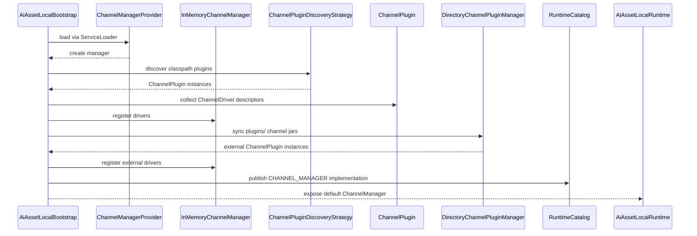
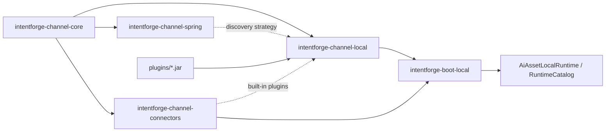

# Task: Channel Runtime Module

## Requirement
Create a new `intentforge-channel` aggregate module with four submodules under the current project.
The implementation should reference the OpenClaw channel design, support pluggable multi-channel integrations,
and provide Spring SPI friendly extension points. Code comments must use English.

## Acceptance Criteria
- [x] Add a new `intentforge-channel` aggregate module with exactly four submodules wired into the Maven reactor.
- [x] Provide a pluggable channel runtime spine with shared channel abstractions, manager SPI, local plugin loading, and Spring SPI bridge support.
- [x] Keep the design ready for future Telegram and WeCom adapters without hard-coding vendor logic into the core module.
- [x] Update architecture documentation to describe the new channel modules and plugin/runtime extension model.
- [x] Pass `make test` without errors before delivery.

## Overall Status
- status: finished
- process: 100%
- current_step: completed

## Steps
| step | description | status | note |
| --- | --- | --- | --- |
| 1 | Create the task tracker, define scope, and verify git checkpoint support. | finished | commit: 6513ec0 |
| 2 | Add channel aggregate Maven structure and TDD coverage for core SPI, Spring discovery, and bootstrap integration. | finished | commit: ed74035 |
| 3 | Implement channel core/local/spring/connectors modules and runtime wiring. | finished | commit: c454ec2 |
| 4 | Update docs, run validation, and finish with checkpoint commits and final task bookkeeping. | finished | commit: 6fd8555 |

## Update Log
| time | status | process | update |
| --- | --- | --- | --- |
| 2026-03-13 15:18:19 +0800 | running | 5% | task initialized, git repository availability verified, and channel module development started |
| 2026-03-13 15:23:39 +0800 | running | 20% | added the channel aggregate Maven structure and TDD test skeleton, then confirmed the expected red test state due to missing production channel classes |
| 2026-03-13 15:29:56 +0800 | running | 70% | implemented channel core/local/spring/connectors modules, wired channel manager into local bootstrap, and verified module plus boot-local targeted tests; one broader sandbox run still hit an unrelated socket-permission failure in existing tool connector tests |
| 2026-03-13 15:29:56 +0800 | running | 85% | updated architecture and README documents to describe the new channel runtime modules and their plugin discovery model; full validation remains pending |
| 2026-03-13 15:41:32 +0800 | running | 95% | reran `make test` outside the sandbox, synchronized boot-local and boot-server runtime-selection assertions with the new `CHANNEL_MANAGER` capability, and confirmed the full Maven reactor test suite passed |
| 2026-03-13 15:45:25 +0800 | finished | 100% | recorded the final checkpoint commit, completed task bookkeeping, and documented the bootstrap plus plugin-discovery flow with Mermaid diagrams |

## Sequence Diagram

## Module Relationship Diagram

