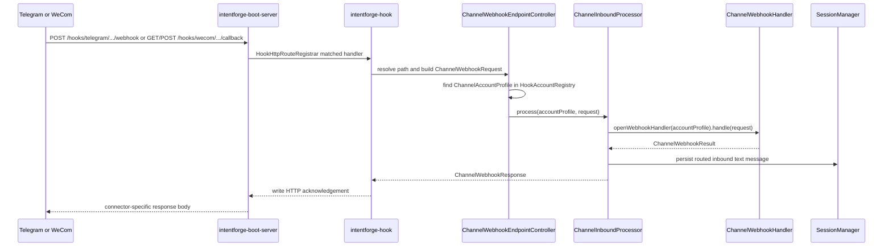
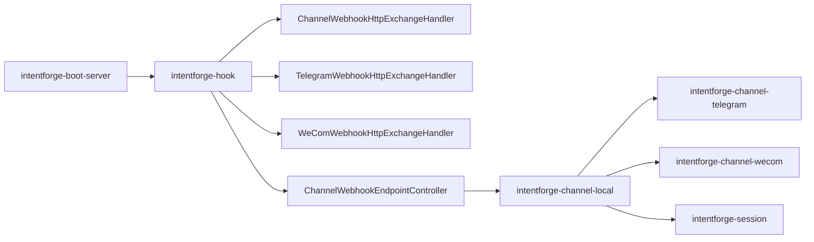

# Task: Hook Channel Endpoints

## Requirement
Add concrete Telegram and WeCom hook endpoint families inside `intentforge-hook`.
These platform-specific HTTP paths should live beside the existing generic channel hook route and delegate into the same `ChannelInboundProcessor` pipeline.

## Acceptance Criteria
- [x] Expose one Telegram-specific hook route under `/open-api/hooks/telegram/accounts/{accountId}/webhook`.
- [x] Expose one WeCom-specific hook route under `/open-api/hooks/wecom/accounts/{accountId}/callback`.
- [x] Keep platform-specific hook routes implemented inside `intentforge-hook` instead of `intentforge-boot-server` or connector modules.
- [x] Reuse the existing transport-neutral `ChannelWebhookEndpointController` and `HookAccountRegistry` instead of duplicating connector logic.
- [x] Wire the new endpoint families through `HookHttpRouteRegistrar` and `AiAssetServerBootstrap`.
- [x] Cover Telegram route parsing, WeCom route parsing, unsupported path handling, and boot-server integration with deterministic tests.
- [x] Update architecture and API documentation for the new platform-specific hook paths.
- [x] Pass `make test` without errors after the new endpoint families are added.

## Overall Status
- status: finished
- process: 100%
- current_step: completed

## Steps
| step | description | status | note |
| --- | --- | --- | --- |
| 1 | Create the task tracker, add red tests for Telegram and WeCom hook endpoint families, and verify the expected failing state. | finished | commit: af08b77 |
| 2 | Implement Telegram and WeCom hook HTTP handlers plus reusable registration inside `intentforge-hook`. | finished | commit: 74cedaa |
| 3 | Wire the new endpoint families through `boot-server` and verify end-to-end hook routing. | finished | commit: 74cedaa |
| 4 | Update docs and API spec, rerun validation, and finish with checkpoint commits plus final bookkeeping. | finished | commit: 461e93a |

## Update Log
| time | status | process | update |
| --- | --- | --- | --- |
| 2026-03-17 00:00:00 +0800 | running | 5% | task initialized for concrete Telegram and WeCom hook endpoint families inside `intentforge-hook`; scope fixed to platform-specific HTTP routes that still delegate into the shared channel inbound pipeline |
| 2026-03-17 09:18:02 +0800 | running | 20% | added red tests for Telegram-specific and WeCom-specific hook routes plus boot-server integration, then confirmed the expected failing state because the new platform-specific HTTP handler classes do not exist yet |
| 2026-03-17 09:23:43 +0800 | running | 80% | implemented Telegram and WeCom-specific hook handlers, extracted shared `HttpExchange` support, registered all route families through `HookHttpRouteRegistrar`, and verified the new hook and boot-server tests outside the sandbox because local socket binding is required |
| 2026-03-17 09:24:59 +0800 | finished | 100% | documented the new Telegram and WeCom hook route families in the module map, channel runtime notes, and OpenAPI spec, then reran `make test` outside the sandbox and confirmed the full reactor passes with both platform-specific endpoints enabled |

## Sequence Diagram

## Module Relationship Diagram

