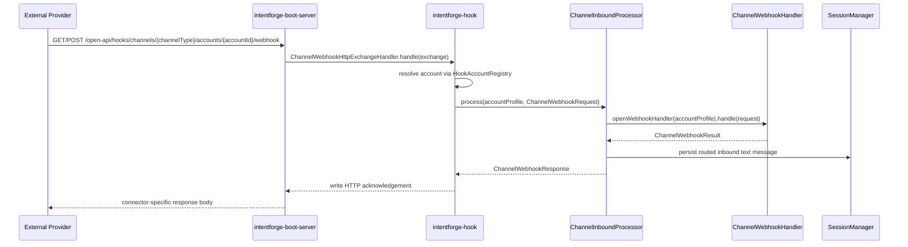
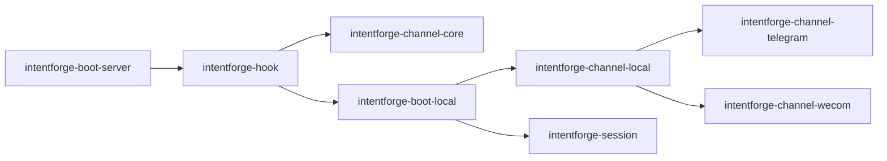

# Task: Hook Module

## Requirement
Create a new `intentforge-hook` module in the current project.
All current and future external hook callback HTTP endpoints should be implemented in this module instead of being scattered inside `boot-server` or connector modules.
The module should integrate with the existing channel inbound runtime and keep connector modules transport-agnostic.

## Acceptance Criteria
- [x] Add a new root Maven module named `intentforge-hook` and wire it into the reactor and BOM.
- [x] Centralize hook HTTP endpoint handling inside `intentforge-hook` instead of `intentforge-boot-server`.
- [x] Expose one generic channel webhook route under `/open-api/hooks/channels/{channelType}/accounts/{accountId}/webhook`.
- [x] Allow the server bootstrap to seed hook-visible `ChannelAccountProfile` entries for endpoint resolution.
- [x] Delegate matched webhook requests into `ChannelInboundProcessor` without embedding connector-specific parsing in the new module.
- [x] Cover route parsing, unsupported path handling, missing account handling, and Telegram inbound integration with deterministic tests.
- [x] Update module, architecture, and API documentation to describe the new hook module and route.
- [x] Pass `make test` without errors after the hook module is added.

## Overall Status
- status: finished
- process: 100%
- current_step: completed

## Steps
| step | description | status | note |
| --- | --- | --- | --- |
| 1 | Create the task tracker, add red tests for the hook module and boot-server integration, and verify the expected failing state. | finished | commit: 0cd35aa |
| 2 | Create `intentforge-hook`, implement generic hook endpoint handling, and add account-profile resolution support. | finished | commit: 0f39d9b |
| 3 | Wire the new module into `boot-server`, the reactor, and the BOM, then verify hook route integration. | finished | commits: 0cd35aa, 0f39d9b |
| 4 | Update docs and API spec, rerun validation, and finish with checkpoint commits plus final bookkeeping. | finished | commit: f959d09 |

## Update Log
| time | status | process | update |
| --- | --- | --- | --- |
| 2026-03-16 17:31:00 +0800 | running | 5% | task initialized for the new hook module; scope fixed to centralizing future hook HTTP endpoints and delegating them into the existing channel inbound runtime |
| 2026-03-16 18:02:35 +0800 | running | 20% | added the `intentforge-hook` reactor skeleton plus red tests for generic channel webhook routing and boot-server integration, then confirmed the expected failing state because the new hook endpoint classes and bootstrap wiring do not exist yet |
| 2026-03-16 18:08:36 +0800 | running | 80% | implemented `intentforge-hook` with the generic channel webhook route, hook-account registry, ingress adapter, and boot-server wiring; added deterministic GET/query forwarding and internal-error tests, then reran the targeted hook and boot-server tests outside the sandbox because local socket binding is required |
| 2026-03-16 18:11:27 +0800 | finished | 100% | documented the new hook module and generic webhook route in the module map, channel runtime notes, and OpenAPI spec, then reran `make test` outside the sandbox and confirmed the full reactor passes with the new ingress module in place |

## Sequence Diagram

## Module Relationship Diagram

