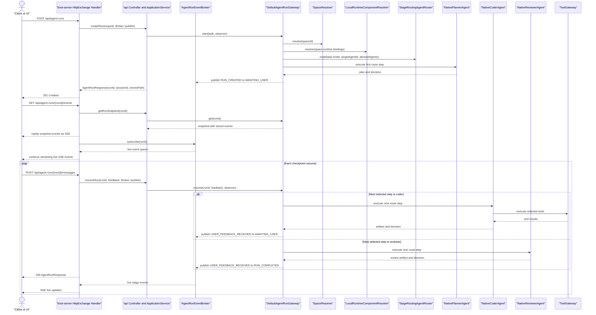
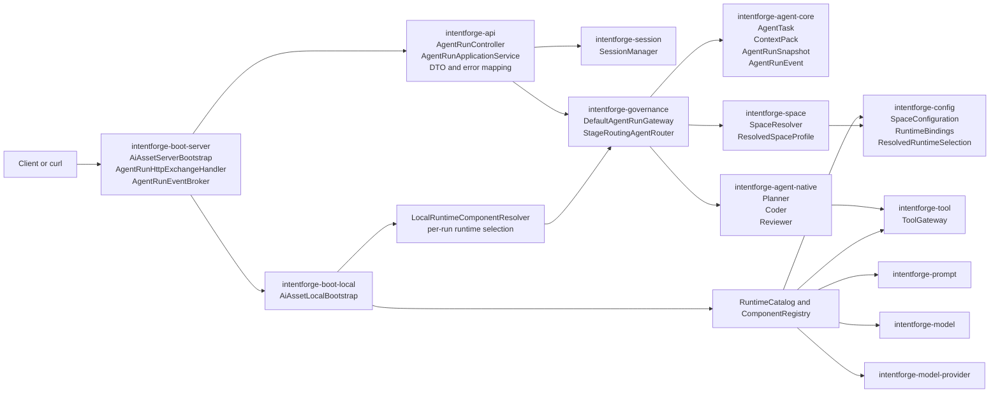

# Task: Native Java Coding Agent Config-Driven Runtime Selection

## Requirement
Starting from the completed event-driven native Java coding agent runtime and minimal API/server chain, extend the run model from the current fixed route checkpoint flow into the actual desired user-directed interaction model. After the planner produces a plan, the run must wait for explicit user confirmation before entering coder or reviewer execution. The user must be able to choose the next agent mode or target agent at each checkpoint, including switching from planner to coder, switching from planner to reviewer, re-entering planner for another iteration, or selecting a different allowed agent implementation. SPI should continue to define only which implementations are available, while user-facing configuration stored in the `config` module should define which capabilities and implementations are bound to each space, including skills, agents, prompts, models, model providers, tools, memory, config providers, and related runtime selectors. `SpaceProfile` should resolve the effective runtime bindings for the current space, every run should expose the final runtime selection through `ContextPack`, `AgentRunSnapshot`, and emitted events, and run snapshots/events must also expose the available user-selectable next actions. The target is a durable architecture rather than an MVP-only shortcut.

## Acceptance Criteria
- [x] `intentforge-agent-core` defines run/event/lifecycle contracts for incremental execution, user-feedback checkpoints, and resume/cancel semantics across module boundaries.
- [x] `intentforge-governance` provides an event-driven run orchestrator that emits ordered stage events, supports `awaiting_user` pauses, and can resume planner/coder/reviewer execution with new feedback.
- [x] `intentforge-agent-native` adapts planner/coder/reviewer execution to the new run lifecycle and preserves multi-turn context across turns.
- [x] `intentforge-boot-local` exposes the event-driven runtime entry needed to start, observe, and continue a run without requiring a future API transport first.
- [x] Unit and integration tests cover normal, boundary, invalid input, pause/resume, cancel, and exception paths, and `make test` passes without warnings or errors.
- [x] `intentforge-api` defines the minimum HTTP contract for run creation, event subscription, user feedback resume, and cancel operations, and the contract documentation is synchronized.
- [x] `intentforge-boot-server` provides the minimum runnable server entrypoint that wires the existing `AgentRunGateway` into HTTP and SSE transport without duplicating governance logic, and request handling prefers virtual threads.
- [x] A local terminal smoke path can start the server and drive one real run through HTTP/SSE end to end.
- [x] `intentforge-config` defines durable configuration contracts and runtime-binding models for user-managed space configuration, including selectors for prompt, model, model-provider, tool, memory, config, and related runtime capabilities.
- [x] `intentforge-space` evolves `SpaceProfile` and `ResolvedSpaceProfile` so that resource bindings and runtime implementation bindings are both inheritable and can be resolved from company to application level.
- [x] SPI discovery is used only to build the catalog of available implementations, while runtime selection is decided by resolved space configuration rather than global bootstrap hardcoding.
- [x] `intentforge-boot-local` and `intentforge-boot-server` assemble a runtime catalog plus per-run runtime selection flow, instead of globally preselecting one implementation for prompt/model/provider/tool/session/space.
- [x] `ContextPack`, `AgentRunSnapshot`, and emitted `AgentRunEvent` metadata expose the final selected runtime implementations so UI and operators can inspect which implementation the current run is using.
- [x] Tests cover configuration inheritance, invalid selector handling, unavailable implementation selection, runtime resolution precedence, and run-time observability of selected implementations.
- [x] Documentation stays synchronized with the new architecture, and all changes pass `make test`.
- [ ] Planner completion no longer auto-advances to a fixed next stage; the run pauses with explicit selectable next actions and requires user confirmation before entering coder or reviewer.
- [ ] `intentforge-agent-core` defines durable contracts for user-directed run transitions, including next-action selection, agent-mode switching, target-agent switching, and validation errors for invalid or disallowed transitions.
- [ ] `intentforge-governance` supports dynamic route mutation or checkpoint continuation based on user-selected next actions instead of only the startup `TaskMode`, while still enforcing space-level allowed agents and runtime bindings.
- [ ] `intentforge-api` and `intentforge-boot-server` expose a transport contract for selecting the next action at a checkpoint, including choosing planner, coder, reviewer, or a specific allowed agent, and SSE events/snapshots show both the selected action and currently available options.
- [ ] Tests cover normal flow, planner rework loops, planner-to-review direct switch, explicit target-agent switch, invalid transition requests, disallowed agent selection, terminal-state mutations, and end-to-end HTTP/SSE interaction for user-directed mode switching.

## Overall Status
- status: running
- process: 10%
- current_step: 19

## Steps
| step | description | status | note |
| --- | --- | --- | --- |
| 1 | Create progress file, inspect architecture/spec docs, inspect existing agent/governance/boot runtime, and verify git checkpoint capability | finished | commit: bd46a0c |
| 2 | Add failing tests for agent contracts, routing/orchestration, native execution, and local bootstrap integration | finished | commit: 7fd06db |
| 3 | Implement agent core abstractions, governance router/gateway, native MVP execution flow, and boot wiring | finished | commit: c1f72dd |
| 4 | Update docs, run full verification, sync task bookkeeping, and finalize synchronous MVP checkpoints | finished | commits: 471b451, 29ce8e5 |
| 5 | Re-scope the completed synchronous MVP to an event-driven multi-turn run model and preserve the recovery baseline | finished | commit: 2404562 |
| 6 | Add failing tests for run lifecycle, event emission, awaiting-user pause, resume, cancel, and transport-agnostic observation flow | finished | commit: ad2ee3c |
| 7 | Implement agent-core run/event contracts, governance orchestrator, native feedback loop, and boot-local event-driven wiring | finished | commit: e81d513 |
| 8 | Update docs, run full verification, sync task bookkeeping, and finalize event-driven checkpoints | finished | commits: e81d513, 87e6526 |
| 9 | Re-scope the completed event-driven runtime to include the minimum API and boot-server chain and preserve the recovery baseline | finished | commits: 3d6a9e8, 1428797 |
| 10 | Add failing tests and API contract updates for run create, SSE events, feedback resume, cancel, minimal boot-server startup flow, and preferred virtual-thread request handling | finished | commit: 8003fe9 |
| 11 | Implement intentforge-api transport contracts and boot-server HTTP/SSE wiring on top of `AgentRunGateway`, preferring virtual threads for request processing | finished | commit: e6495f1 |
| 12 | Update docs, verify terminal smoke flow and full test suite, sync task bookkeeping, and finalize API/server checkpoints | finished | commit: fd7e884 |
| 13 | Re-scope the finished API/server chain to config-driven runtime selection and record the new architecture baseline | finished | commit: ca219b4 |
| 14 | Add red tests and core contracts for config-managed runtime binding models, space inheritance of runtime selectors, and runtime catalog discovery | finished | commits: a73ea1f, ccf6918 |
| 15 | Implement config-core models, space/runtime binding resolution, and bootstrap runtime catalog assembly without global hardcoded implementation winners | finished | commit: 7d3afc7 |
| 16 | Propagate selected runtime bindings into governance, context pack, run snapshot, events, and API-facing observability models | finished | commit: 7d3afc7 |
| 17 | Update architecture/docs, run full verification, sync task bookkeeping, and finalize the configuration-driven runtime-selection architecture | finished | commits: 70f3799, c48aff9, baf1f07 |
| 18 | Re-scope the finished configuration-driven runtime task to the real user-directed transition model and preserve the latest recovery baseline | finished | commit: b36a76a |
| 19 | Add red tests and API contract changes for selectable next actions, planner confirmation, mode switching, target-agent switching, and invalid transition handling | notrun | commit: pending |
| 20 | Extend agent-core and governance contracts to support user-directed transitions, dynamic next-step selection, and allowed-agent validation at checkpoints | notrun | commit: pending |
| 21 | Implement API and boot-server transport changes so clients can select planner, coder, reviewer, or a specific allowed agent from checkpoint state and observe those options over SSE | notrun | commit: pending |
| 22 | Update docs, refresh final diagrams for the new interaction model, run full verification, sync bookkeeping, and finalize the user-directed multi-agent flow | notrun | commit: pending |

## Update Log
| time | status | process | update |
| --- | --- | --- | --- |
| 2026-03-12 18:29:17 +0800 | notrun | 0% | task initialized |
| 2026-03-12 18:29:17 +0800 | running | 5% | task started; required docs inspected; current agent/governance modules are mostly placeholders; git checkpoint capability verified |
| 2026-03-12 18:33:43 +0800 | running | 25% | finalized MVP layering: agent-core for contracts, governance for routing/gateway, agent-native for planner/coder/reviewer, boot-local for wiring; started adding red tests and module dependencies |
| 2026-03-12 18:42:08 +0800 | running | 75% | implemented agent-core contracts, governance routing/gateway, native planner/coder/reviewer flow, and boot-local wiring; targeted reactor tests passed for the affected modules |
| 2026-03-12 18:43:02 +0800 | running | 90% | updated architecture docs for the new runtime spine and verified the full reactor with `make test` |
| 2026-03-12 18:43:21 +0800 | finished | 100% | task bookkeeping synchronized after docs checkpoint `471b451`; all acceptance criteria satisfied and full `make test` already passed |
| 2026-03-12 20:46:24 +0800 | running | 10% | scope changed: reopen task from synchronous batch MVP to event-driven multi-turn run model; recovery baseline is the completed checkpoint chain ending at `29ce8e5` |
| 2026-03-12 20:47:29 +0800 | running | 10% | scope-change checkpoint `2404562` recorded; next execution step is to add red tests for the event-driven run lifecycle |
| 2026-03-12 20:49:11 +0800 | running | 20% | step 6 started; current design has no run/event/observer contracts and no pause-resume lifecycle, so the next checkpoint will add red tests around event-driven orchestration and multi-turn feedback |
| 2026-03-12 20:53:47 +0800 | running | 35% | added red tests for agent-core run messages, governance run lifecycle, native feedback propagation, and boot-local event-driven integration; targeted build fails at missing run/event contracts as expected |
| 2026-03-12 20:58:36 +0800 | running | 80% | implemented event-driven run contracts, in-memory run orchestration, native feedback propagation, and boot-local wiring; targeted reactor tests passed for agent-core, governance, agent-native, and boot-local |
| 2026-03-12 21:00:36 +0800 | finished | 100% | full `make test` passed after the event-driven run model landed; acceptance criteria are satisfied and final task bookkeeping is being synchronized |
| 2026-03-12 21:01:21 +0800 | finished | 100% | task bookkeeping synchronized after docs checkpoint `87e6526`; event-driven multi-turn run model is fully closed |
| 2026-03-12 21:44:12 +0800 | running | 10% | scope changed again: reopen the finished event-driven runtime task to add the minimum API and boot-server chain needed for terminal real calls; current gap is that `boot-server` is still a placeholder and there is no HTTP/SSE transport layer yet |
| 2026-03-12 21:44:33 +0800 | running | 15% | scope-change checkpoint `3d6a9e8` recorded; next execution step is to add red tests and minimal API contracts for the server chain |
| 2026-03-12 21:51:03 +0800 | running | 15% | scope refined: the API/server phase must prefer virtual threads for request handling unless a concrete blocker is found and recorded during implementation |
| 2026-03-12 21:51:18 +0800 | running | 15% | scope refinement checkpoint `1428797` recorded; step 10 remains the next active work item with virtual-thread preference now fixed in the task definition |
| 2026-03-12 21:57:35 +0800 | running | 20% | step 10 started; current repo has no `docs/api-spec.yaml`, no HTTP DTOs in `intentforge-api`, and no runnable `boot-server`, so the next checkpoint will add red tests plus the first minimal OpenAPI contract for create, events, feedback, cancel, and virtual-thread-backed server startup |
| 2026-03-12 22:00:33 +0800 | running | 35% | added red tests for HTTP DTOs, boot-server HTTP/SSE lifecycle, cancel, and virtual-thread executor preference, and created the first `docs/api-spec.yaml`; targeted build fails at missing API transport models and server bootstrap classes as expected |
| 2026-03-12 22:04:27 +0800 | running | 70% | implemented minimal HTTP DTOs in `intentforge-api`, JDK `HttpServer` + SSE transport in `boot-server`, virtual-thread request executor wiring, and a terminal-startable demo main; targeted reactor tests now pass for the API and server modules |
| 2026-03-12 22:06:22 +0800 | finished | 100% | updated architecture and module docs, verified a real terminal smoke flow through `AiAssetServerMain` using `curl` for create, SSE replay/live events, resume, and completion, and passed the full `make test` reactor |
| 2026-03-12 22:06:55 +0800 | finished | 100% | task bookkeeping synchronized after docs checkpoint `fd7e884`; the minimal API + boot-server chain is fully closed with virtual-thread-backed request handling |
| 2026-03-12 23:31:39 +0800 | running | 5% | scope changed again: reopen the completed API/server chain toward a configuration-driven architecture where SPI only declares available implementations, `config` stores user-facing space configuration, `SpaceProfile` resolves runtime bindings, and run-time artifacts expose the final selected implementations |
| 2026-03-12 23:35:28 +0800 | running | 20% | step 14 started; added red tests and landed the first formal runtime-binding model in `intentforge-config-core`, then extended `SpaceProfile` and `ResolvedSpaceProfile` so runtime implementation bindings inherit and resolve across the space hierarchy |
| 2026-03-12 23:41:49 +0800 | running | 35% | step 14 is closed and step 15 has started; runtime catalogs and stable provider descriptors now exist for prompt/model/model-provider/tool/session, and `boot-local` exposes discovered implementations, but governance still needs to switch from global runtime components to per-run space-selected components |
| 2026-03-13 00:17:27 +0800 | running | 90% | checkpoint `7d3afc7` completed steps 15 and 16: `config-core` now defines `SpaceConfiguration` and `ResolvedRuntimeSelection`, `boot-local` assembles runtime catalogs plus component registries, governance resolves prompt/model/provider/tool per run from `SpaceProfile.runtimeBindings`, and HTTP responses now expose selected runtimes; docs sync and full `make test` remain |
| 2026-03-13 00:18:45 +0800 | finished | 100% | architecture docs, OpenAPI contract, config README, and task bookkeeping have been updated; `make test` now passes across the full reactor after test checkpoint `70f3799` stabilized unordered runtime-selection responses |
| 2026-03-13 00:19:39 +0800 | finished | 100% | task bookkeeping synchronized after docs checkpoint `c48aff9`; the configuration-driven runtime-selection architecture is fully closed |
| 2026-03-13 14:35:00 +0800 | finished | 100% | refreshed the final diagrams to match the latest controller/application-service split, SSE replay/live behavior, and the current route-driven checkpoint model instead of implying a fully free-form Plan to Code to Review mode switch |
| 2026-03-13 09:30:07 +0800 | running | 10% | scope changed again: reopen the finished configuration-driven runtime task toward the real user-directed transition model where planner completion requires explicit user confirmation and the user can choose the next mode or allowed agent at each checkpoint; the latest completed recovery baseline remains the current implementation chain ending at `18dfc6d` |

## Current Baseline Sequence Diagram

Current implemented baseline: `POST /api/agent-runs` creates the run and immediately starts event-driven execution. The SSE transport is established by `GET /api/agent-runs/{runId}/events` after the client receives `runId`; the server first replays `AgentRunSnapshot.events()` and then streams live events, so planner output is not lost even if the SSE connection is opened after run creation. The current implementation is still route-driven: `StageRoutingAgentRouter` selects the stage pipeline from `TaskMode` up front, and user feedback resumes the next checkpoint on that selected route instead of arbitrarily switching the same run to a new mode. This baseline will be replaced after the new user-directed transition model is implemented.

## Current Baseline Module Relationship Diagram

