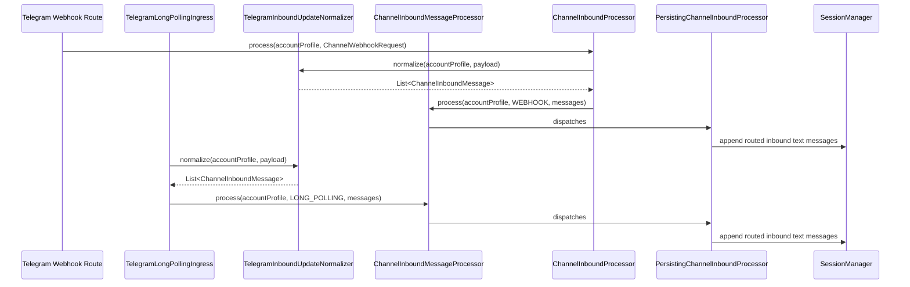
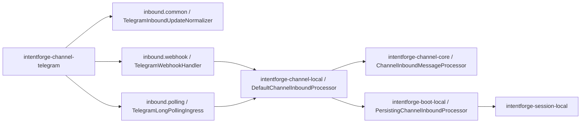

# Task: Telegram Inbound Message Output

## Requirement
Refactor Telegram inbound handling so webhook and long polling share one unified inward message output path.
The Telegram module should normalize raw updates once, then forward normalized inbound messages into one common message-level processor instead of forcing long polling through a synthetic webhook request.

## Acceptance Criteria
- [x] Telegram inbound normalization is extracted into shared logic that both webhook and long polling use.
- [x] Channel runtime exposes one message-level inbound processor for already normalized inbound messages.
- [x] Long polling stops constructing synthetic `ChannelWebhookRequest` objects and sends normalized messages through the shared message-level processor.
- [x] Existing webhook HTTP behavior and response contract remain unchanged.
- [x] Session persistence still happens for both webhook and long-polling inbound messages.
- [x] Tests cover message-level processing, polling forwarding, and webhook regression behavior.
- [x] Documentation describes the unified inward message output design.
- [x] Full `make test` passes after the refactor.

## Overall Status
- status: finished
- process: 100%
- current_step: completed

## Steps
| step | description | status | note |
| --- | --- | --- | --- |
| 1 | Add task scope and red tests for shared Telegram normalization and message-level inbound processing. | finished | commit: 7f9f27f |
| 2 | Implement channel-core/local message-level inbound processor and persistence wiring. | finished | commit: 498e9d5 |
| 3 | Refactor Telegram webhook and long polling to use the shared message output path. | finished | commit: 498e9d5 |
| 4 | Update docs, rerun validation, and finalize checkpoints. | finished | commit: pending-final-checkpoint |

## Update Log
| time | status | process | update |
| --- | --- | --- | --- |
| 2026-03-18 14:31:58 +0800 | running | 5% | Initialized task for unified Telegram inbound message output across webhook and long polling. |
| 2026-03-18 14:33:57 +0800 | running | 20% | Added red tests for message-level inbound processing in local runtime and Telegram long polling, then confirmed the expected compilation failures because the new shared inbound source and message processor abstractions do not exist yet. |
| 2026-03-18 14:38:17 +0800 | running | 80% | Added shared channel-level message processing abstractions, wired local inbound persistence for normalized message batches, extracted `TelegramInboundUpdateNormalizer`, and refactored Telegram long polling to emit normalized messages directly into the shared processor. Focused Telegram, local, and boot-local tests passed, and boot-server compilation passed. |
| 2026-03-18 14:40:48 +0800 | finished | 100% | Updated architecture and bootstrap documentation for the unified inbound message output path, reran the full `make test` suite successfully, and prepared the final checkpoint updates for this task. |

## Sequence Diagram

## Module Relationship Diagram

