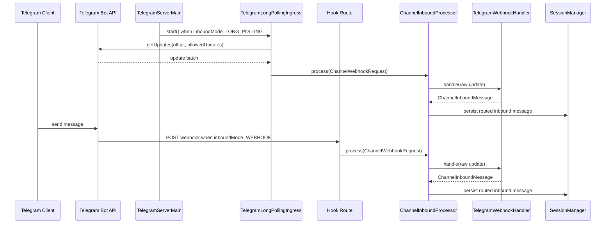
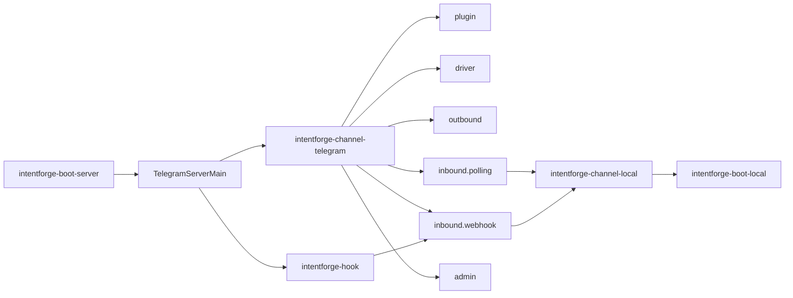

# Task: Telegram Inbound Mode

## Requirement
Add Telegram long polling support beside the existing webhook ingress.
Telegram local/server integration should default to long polling, allow manual switching to webhook mode, and reorganize the `intentforge-channel-telegram` module into clearer package groups by responsibility.

## Acceptance Criteria
- [x] Telegram connector supports long polling update retrieval in addition to webhook handling.
- [x] Telegram-specific startup defaults to long polling mode and can be switched to webhook mode through explicit settings.
- [x] Webhook-only behavior remains available when webhook mode is selected, including secret validation and webhook auto-management.
- [x] Telegram connector classes are reorganized into package groups that reflect plugin, driver, outbound, inbound, and admin responsibilities.
- [x] Tests cover long polling defaults, webhook switching, polling update normalization, and package reorganization regressions.
- [x] Architecture and bootstrap documentation describe the new inbound mode model and startup settings.
- [x] Full `make test` passes after the change.

## Overall Status
- status: finished
- process: 100%
- current_step: completed

## Steps
| step | description | status | note |
| --- | --- | --- | --- |
| 1 | Add task scope and red tests for Telegram inbound mode defaults, webhook switching, and long polling processing. | finished | commit: b8ec552 |
| 2 | Implement Telegram long polling support and default-mode startup wiring. | finished | commit: 503ba9f |
| 3 | Reorganize the Telegram module into responsibility-based packages and update imports/resources. | finished | commit: 503ba9f |
| 4 | Update docs, rerun validation, and finalize checkpoints. | finished | commit: 980e279 |

## Update Log
| time | status | process | update |
| --- | --- | --- | --- |
| 2026-03-17 11:00:00 +0800 | running | 5% | Initialized task for Telegram long polling support, webhook mode switching, and Telegram module package reorganization. |
| 2026-03-17 11:07:58 +0800 | running | 20% | Added red tests for the default long-polling startup mode, explicit webhook switching, and Telegram long-polling batch forwarding, then confirmed the expected compilation failures because the new inbound-mode classes and polling runtime do not exist yet. |
| 2026-03-17 11:31:53 +0800 | running | 80% | Implemented `TelegramServerMain` with default long-polling startup, added Telegram long-polling ingress plus `getUpdates` client support, reorganized the Telegram connector into plugin/driver/outbound/inbound/admin packages, and reran the focused Telegram module plus boot-server tests successfully. |
| 2026-03-17 14:00:17 +0800 | finished | 100% | Updated architecture and startup documentation for long-polling-first Telegram ingress, reran the full `make test` suite successfully, and prepared the final checkpoint updates for this task. |
| 2026-03-17 14:01:09 +0800 | finished | 100% | Recorded the documentation checkpoint commit `980e279` in the task tracker and closed the Telegram inbound mode task. |

## Sequence Diagram

## Module Relationship Diagram

