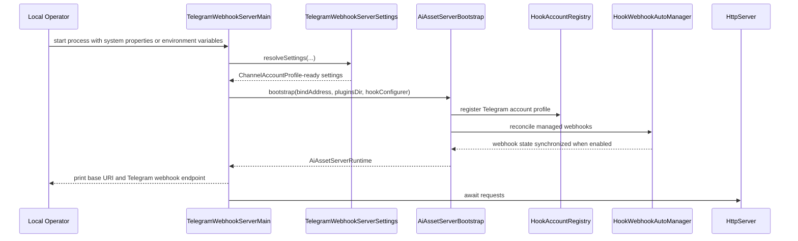
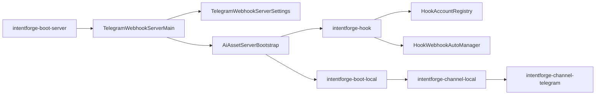

# Task: Telegram Server Main

## Requirement
Add a Telegram-specific boot-server entrypoint that manually registers one Telegram hook account from system properties or environment variables so local end-to-end webhook testing does not require a custom bootstrap class.

## Acceptance Criteria
- [x] `intentforge-boot-server` provides a Telegram-specific main class for local server startup.
- [x] The Telegram-specific main can resolve account settings from system properties with environment-variable fallback.
- [x] The Telegram-specific main manually registers the Telegram hook account and exposes the Telegram webhook route.
- [x] Documentation describes the new Telegram-specific startup entrypoint and its supported settings.
- [x] Validation covers settings resolution, invalid input, integration behavior, and full `make test`.

## Overall Status
- status: finished
- process: 100%
- current_step: completed

## Steps
| step | description | status | note |
| --- | --- | --- | --- |
| 1 | Add task scope and red tests for Telegram-specific server main settings and startup behavior | finished | commit: 87bae82 |
| 2 | Implement Telegram-specific server main and manual hook account registration wiring | finished | commit: 87bae82 |
| 3 | Update docs, run verification, and finalize checkpoints | finished | commit: a2e5fac |

## Update Log
| time | status | process | update |
| --- | --- | --- | --- |
| 2026-03-17 10:33:57 +0800 | running | 5% | Initialized task for a Telegram-specific boot-server entrypoint that manually registers one hook account from properties or environment variables. |
| 2026-03-17 10:37:29 +0800 | running | 85% | Added `TelegramWebhookServerMain`, account-settings resolution with environment fallback, manual hook-account registration wiring, and focused tests. Checkpoint commit: 87bae82. |
| 2026-03-17 10:40:20 +0800 | finished | 100% | Updated architecture notes for the Telegram-focused startup entrypoint, reran the focused boot-server tests plus full `make test`, recorded docs checkpoint `a2e5fac`, and synchronized the final task bookkeeping for the new local webhook server main. |

## Sequence Diagram

## Module Relationship Diagram

