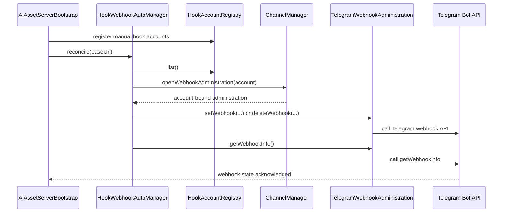
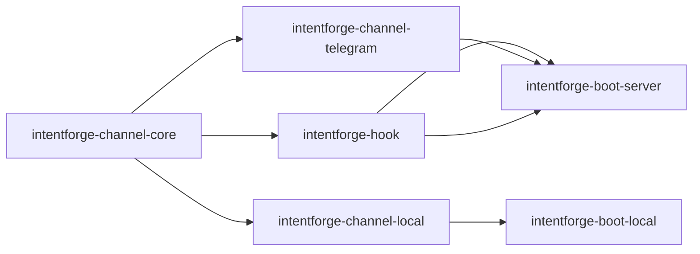

# Task: Telegram Webhook Management

## Requirement
Add automatic Telegram webhook lifecycle management for manually registered hook accounts. The server should be able to reconcile Telegram webhook state at startup without introducing a formal configuration center yet.

## Acceptance Criteria
- [ ] Telegram connector exposes account-bound webhook administration for `setWebhook`, `deleteWebhook`, and `getWebhookInfo`.
- [ ] Server bootstrap automatically reconciles manually registered Telegram webhook accounts when automatic management is enabled in account properties.
- [ ] Hook account registration remains manual for this phase, but automatic webhook management can derive the public webhook URL from account properties or the running server base URI.
- [ ] Documentation describes the new manual-account webhook management flow.
- [ ] Validation covers unit and integration cases and `make test` passes.

## Overall Status
- status: finished
- process: 100%
- current_step: completed

## Steps
| step | description | status | note |
| --- | --- | --- | --- |
| 1 | Define webhook management task scope and add red tests for Telegram admin lifecycle and startup reconciliation | finished | commit: 8279fff |
| 2 | Implement Telegram webhook administration and generic webhook auto-management wiring | finished | commit: 8279fff |
| 3 | Update docs, run verification, and finalize checkpoints | finished | commit: 8eb50af |

## Update Log
| time | status | process | update |
| --- | --- | --- | --- |
| 2026-03-17 10:15:07 +0800 | running | 5% | Initialized task for Telegram automatic webhook lifecycle management on top of manual hook account registration. |
| 2026-03-17 10:21:15 +0800 | running | 85% | Added shared webhook administration SPI, Telegram webhook admin client and lifecycle adapter, startup-time hook webhook auto-manager, and passing targeted tests. Checkpoint commit: 8279fff. |
| 2026-03-17 10:23:48 +0800 | finished | 100% | Updated architecture docs, verified targeted integration tests plus full `make test`, and recorded documentation checkpoint commit 8eb50af. |

## Sequence Diagram

## Module Relationship Diagram

