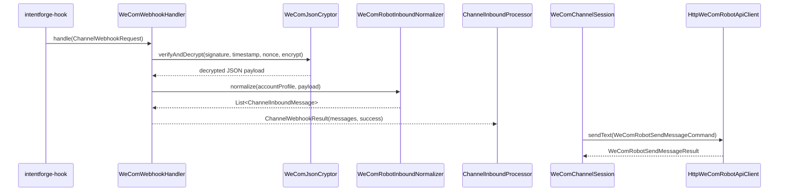
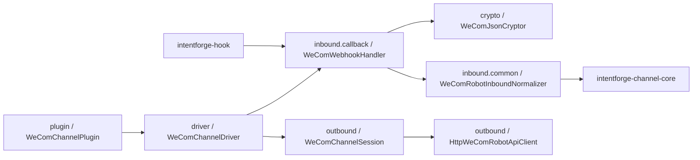

# Task: WeCom Intelligent Robot

## Requirement
Replace the existing WeCom application-messaging connector with a WeCom intelligent-robot connector.
The `intentforge-channel-wecom` module should only support the intelligent-robot callback model and its matching outbound message sending shape, while keeping the existing `channel`, `hook`, and `boot` module boundaries unchanged.

## Acceptance Criteria
- [x] The legacy WeCom application-messaging implementation is removed from `intentforge-channel-wecom`.
- [x] The WeCom connector is reorganized into package groups for plugin, driver, inbound, outbound, crypto, and shared support.
- [x] Inbound WeCom intelligent-robot callbacks support verification, signature validation, AES decryption, and normalized text-message output.
- [x] Outbound WeCom intelligent-robot sending maps `ChannelOutboundRequest` into one robot-oriented send command.
- [x] The existing WeCom hook route `/open-api/hooks/wecom/accounts/{accountId}/callback` continues to work with the new connector.
- [x] Documentation reflects that `intentforge-channel-wecom` now targets intelligent robots instead of self-built applications.
- [x] Full `make test` passes after the replacement.

## Overall Status
- status: finished
- process: 100%
- current_step: completed

## Steps
| step | description | status | note |
| --- | --- | --- | --- |
| 1 | Add task scope and red tests for the intelligent-robot crypto, inbound callback, and outbound session behavior. | finished | commit: 6dc04a0 |
| 2 | Replace the WeCom connector implementation with intelligent-robot driver, crypto, inbound, and outbound packages. | finished | commit: 6dc04a0 |
| 3 | Update hook-facing tests, docs, and runtime notes for the intelligent-robot-only WeCom connector. | finished | commits: 6dc04a0, fe0ffd6 |
| 4 | Run full validation, finalize bookkeeping, and close the task. | finished | commit: fe0ffd6 |

## Update Log
| time | status | process | update |
| --- | --- | --- | --- |
| 2026-03-18 15:20:00 +0800 | running | 5% | Initialized task for replacing the legacy WeCom application connector with an intelligent-robot-only connector. |
| 2026-03-18 15:25:07 +0800 | running | 90% | Replaced the WeCom application connector with an intelligent-robot implementation, reorganized the module into plugin/driver/shared/crypto/inbound/outbound packages, updated hook-side test fixtures, and recorded checkpoint commit `6dc04a0`. |
| 2026-03-18 15:26:42 +0800 | finished | 100% | Updated docs and hook-facing integration fixtures, reran the full `make test` suite successfully, and recorded documentation checkpoint commit `fe0ffd6`. |

## Sequence Diagram

## Module Relationship Diagram

