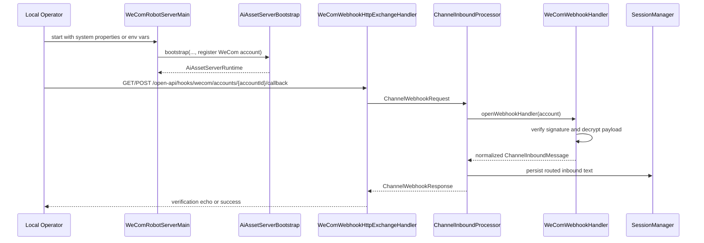
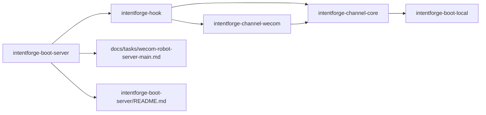

# Task: WeCom Robot Server Main

## Requirement
Add a WeCom intelligent-robot-focused boot-server entrypoint and local smoke-test documentation.
The new entrypoint should manually register one WeCom robot hook account from system properties or environment variables so local callback testing does not require a custom bootstrap class.

## Acceptance Criteria
- [x] `intentforge-boot-server` provides one WeCom robot-specific terminal main entrypoint.
- [x] The entrypoint resolves WeCom robot settings from system properties first and environment variables second.
- [x] The entrypoint registers one hook-visible WeCom robot account and exposes the canonical WeCom callback route.
- [x] Tests cover settings resolution, invalid required settings, and hook-route availability.
- [x] Boot-server README documents a copy-paste local WeCom robot smoke-test flow.
- [x] `make test` passes after the new entrypoint is added.

## Overall Status
- status: finished
- process: 100%
- current_step: completed

## Steps
| step | description | status | note |
| --- | --- | --- | --- |
| 1 | Add task scope and red tests for WeCom robot server settings and hook registration. | finished | commit: 54af351 |
| 2 | Implement the WeCom robot server main and settings mapping in boot-server. | finished | commit: 54af351 |
| 3 | Document the local WeCom robot smoke-test flow and update architecture notes. | finished | commit: 8b9d2ed |
| 4 | Run full validation, finalize bookkeeping, and close the task. | finished | commit: 8b9d2ed |

## Update Log
| time | status | process | update |
| --- | --- | --- | --- |
| 2026-03-18 15:35:00 +0800 | running | 5% | Initialized task for adding a WeCom intelligent-robot boot-server entrypoint and local smoke-test documentation. |
| 2026-03-18 15:52:00 +0800 | running | 60% | Added `WeComRobotServerMain` and `WeComRobotServerSettings`, and the targeted `WeComRobotServerMainTest` now passes. |
| 2026-03-18 16:21:01 +0800 | running | 90% | Updated boot-server and architecture documentation for the WeCom robot entrypoint, and `make test` passed. |
| 2026-03-18 16:24:00 +0800 | finished | 100% | Finalized the task tracker with commit checkpoints and completion diagrams. |

## Sequence Diagram

## Module Relationship Diagram

